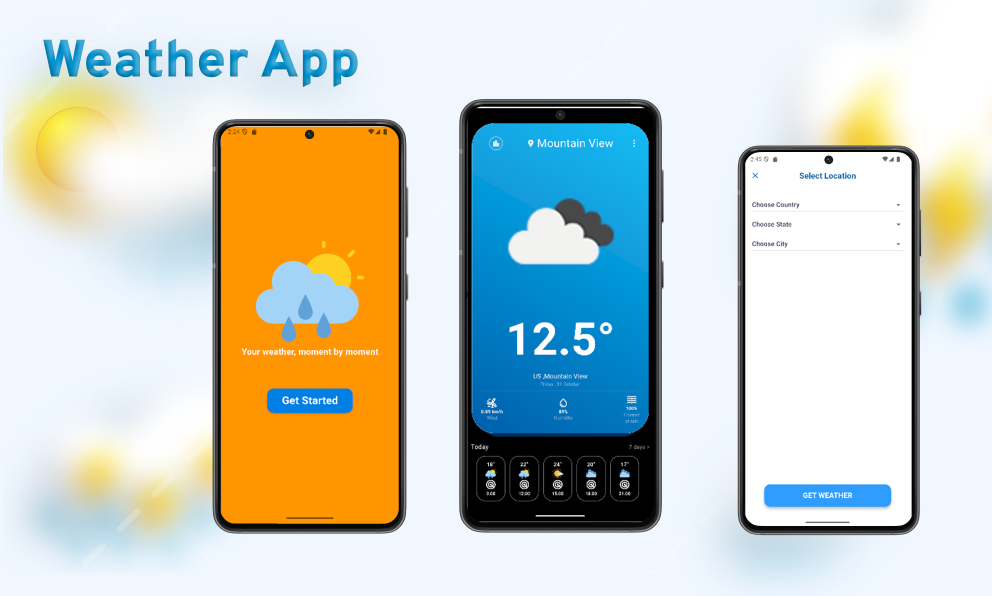

# 🌤 Weather App – Flutter

**WeatherApp** is a modern Flutter application that displays **real-time weather information** for any selected city.  
It integrates the **OpenWeatherMap API** to fetch live temperature, humidity, wind speed, and hourly forecasts — all within a clean, modern Material Design interface.

--

## ☁️ API Used
- **OpenWeatherMap API** → Provides live and forecasted weather data such as temperature, humidity, clouds, and wind.  
  - **Endpoints used:**
    - `https://api.openweathermap.org/data/2.5/weather` → For current weather.  
--

## 🚀 Features
✅ Live weather updates using **OpenWeatherMap API**  
✅ Hourly forecast display with smooth animations  
✅ Gradient-based modern UI design  
✅ City and country picker integration  
✅ Responsive layout for all screen sizes  

--

## 🧩 Packages Used
- **http** → For fetching data from OpenWeatherMap.  
- **intl** → For date formatting (e.g., `friday, 31 October`).  
- **country_state_city_picker** → For selecting countries and cities.  

--

## ⚙️ How It Works
1. The app fetches weather data using **OpenWeatherMap API**.  
2. Data is parsed inside a `Weather` model class.  
3. The main screen (`LocationScreen`) shows:  
   - Current weather information via `WeatherCard`.  
4. The user can open a location picker to change their city and view updated weather instantly.  

---
🔗 **Live Demo:** https://drive.google.com/drive/folders/1QJoWY2UrZu-PnZd2ZA1dr81v2uOO5CPO?usp=drive_link

## 📷 Screens

